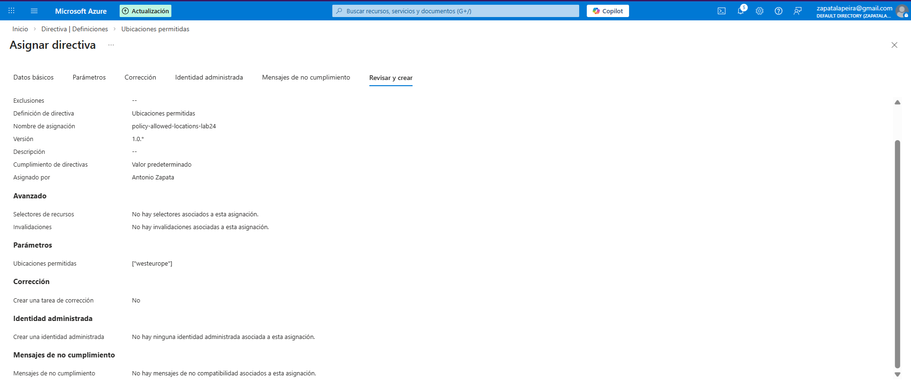
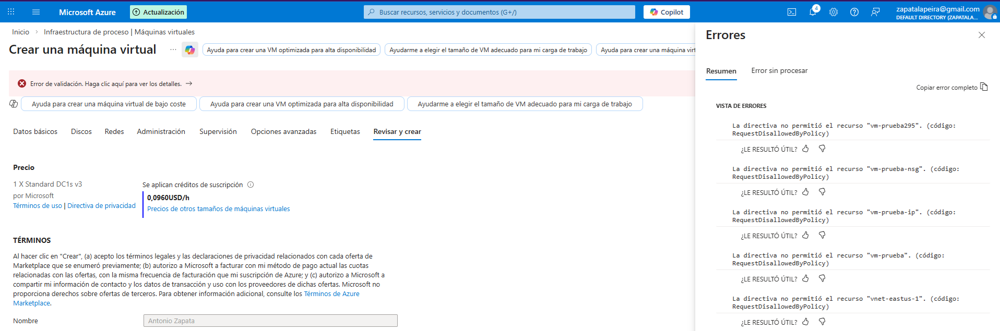

# Lab 24 – Azure Policy: Restricción de regiones (Allowed locations)

## Objetivo
Evitar que se creen recursos fuera de las regiones permitidas por la organización.  
Este control se usa para cumplimiento (por ejemplo, GDPR) y para estandarizar despliegues.

---

## Qué he hecho en este laboratorio

1. He asignado la directiva **Allowed locations** para limitar dónde se pueden desplegar recursos.
2. He permitido únicamente la región **West Europe**.
3. He validado el bloqueo intentando crear un recurso en **East US**, y Azure lo ha denegado en tiempo de creación.

---

## Arquitectura y concepto

Azure Policy aplica reglas de gobierno sobre recursos.  
En este caso, la directiva **Allowed locations** fuerza que los despliegues solo puedan realizarse en una lista de regiones aprobadas.

Esto evita errores, controla costes y reduce riesgos de cumplimiento (datos en regiones no autorizadas).

---

## Configuración utilizada

- Directiva: `Allowed locations` (Ubicaciones permitidas)
- Ámbito: `rg-policy-lab24` (recomendado para pruebas)
- Región permitida: `West Europe`
- Efecto: Deny (bloqueo en creación)

---

## Validación funcional

Se ha intentado crear un recurso en **East US** dentro del ámbito afectado por la directiva, y Azure ha devuelto un error de validación indicando que la ubicación no está permitida.

---

## Evidencias

### 01 – Asignación de la policy con región permitida

Se muestra la asignación de **Allowed locations** y el parámetro con **West Europe** como única ubicación permitida.

---

### 02 – Bloqueo al desplegar en una región no permitida

Se muestra el error al intentar desplegar un recurso en **East US**, bloqueado por Azure Policy.

---

## Checklist de verificación

- [x] Policy **Allowed locations** asignada
- [x] Solo **West Europe** permitida en parámetros
- [x] Despliegue en **East US** bloqueado (Deny)

---

## Qué le diría a un cliente o en entrevista

“Uso Azure Policy para evitar que se creen recursos en regiones no autorizadas. Así aseguro cumplimiento y estandarización, y reduzco despliegues accidentales en regiones caras o fuera de normativa.”

---

